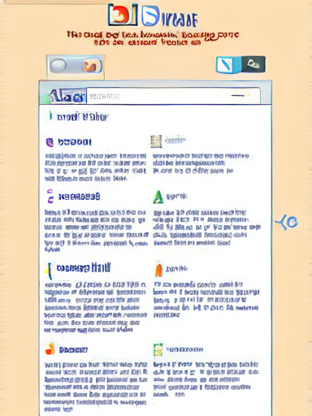
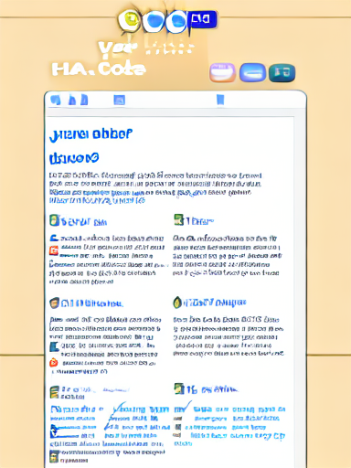

# Bachelor Thesis

This repository holds the accompanying code for my (upcoming) bachelor thesis.

> [!IMPORTANT]  
> The thesis can be divided into four distinct experiments which are all based on each other. Experiment 1 is seperate, all the other ones are divided into multiple notebooks, which all contain some documentation about what they do. Only the first experiment is explained in detail in this readme.

## Experiment 1

The general idea is to use StableDiffusion Img2Img Metric based optimizations of screenshots of User Interfaces to increase perceived aesthetic.

### What has been done up to now

- Created a Stable Diffusion finetuning Dataset, which has been created with screenshots from the RICO dataset by the InteractionMining research group ([link](http://www.interactionmining.org/rico.html)), which then have been automatically annotated using the [Salesforce BLIP model](https://github.com/salesforce/BLIP). The dataset can be found on huggingface: [mowoe/rico-captions-blip-large-conditioned](https://huggingface.co/datasets/mowoe/rico-captions-blip-large-conditioned)
- Ported the code from the 2022 Paper "Modeling how different user groups perceive webpage aesthetics" (Luis A. Leiva, Morteza Shiripour, Antti Oulasvirta [doi:10.1007/s10209-022-00910-x](https://link.springer.com/article/10.1007/s10209-022-00910-x)) to use Pytorch while preserving the proposed model architecture. Model has been trained again and published on huggingface too: [mowoe/modeling_how_different_user_groups_model](https://huggingface.co/mowoe/modeling_how_different_user_groups_model)
- Finetuned a Stable Diffusion model to use the mentioned dataset, huggingface: [mowoe/stable-diffusion-v1-4-rico-blip-large-conditioned](https://huggingface.co/mowoe/stable-diffusion-v1-4-rico-blip-large-conditioned)

### Outlook
- Use [WebSight](https://huggingface.co/HuggingFaceM4/VLM_WebSight_finetuned) (img2html) models to generate valid code from optimized screenshot (unlikely to return favourable results)
- Introduce penalty when semantic meaning changes too much (Screen2Vec [10.1145/3411764](https://dl.acm.org/doi/pdf/10.1145/3411764.3445049))
- Use some text detection model to fix malforme d text in generated screenshots
- Not using BLIP interrogation, dataset doesnt look very good currently
- Better fine-tuning of SD model, process is extremely instable
- Use a better aesthetic model, the one present is very small and (therefore) very prone to get adversarial attacked

## Repo Structure
Code for annotating the RICO dataset to create a finetuning SD dataset is stored in [`BlipLarge_RICO_Annotator.ipynb`](BlipLarge_RICO_Annotator.ipynb)

---

Reimplementation of the "Modeling how different user groups perceive webpage aesthetics" can be found in [`ModelingHowDifferentUserGroups_PyTorch.py`](ModelingHowDifferentUserGroups_PyTorch.py)

---

[`full_gradient_descent.py`](full_gradient_descent.py) holds a script which expects a file `0.png` (a screenshot of a User Interface) to be present and it will run 50 optimization steps on it, saving an image in each step.

It should be run with [accelerate](https://huggingface.co/docs/accelerate/index):
```bash
accelerate launch full_gradient_descent.py
```

> [!WARNING]  
> As the autograd graphs for PyTorch get extremely large, a GPU with at least 48Gi of VRAM is required. However, because the script is using accelerate, this can easily be split up to multiple GPUs

## Current results
Currently an example looks like this:
Step 0             |  Step 50
:-------------------------:|:-------------------------:
  |  

As you can see, this is still in the very early stages, but it is already clearly visible that the pipeline is able to modify the UI in some meaningful way.